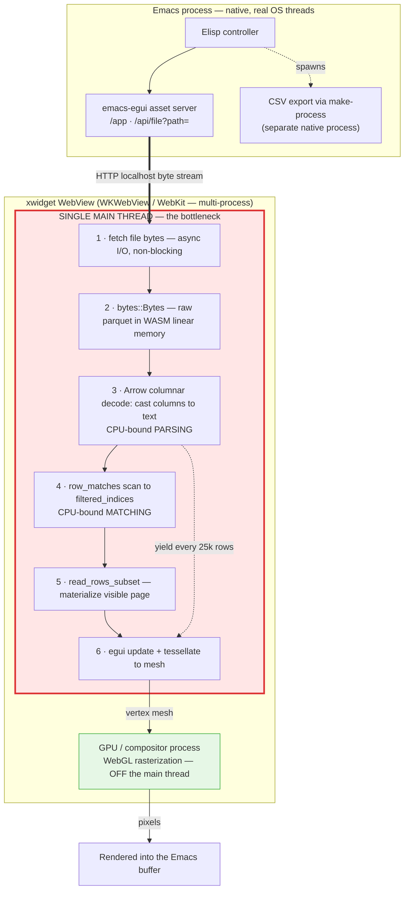
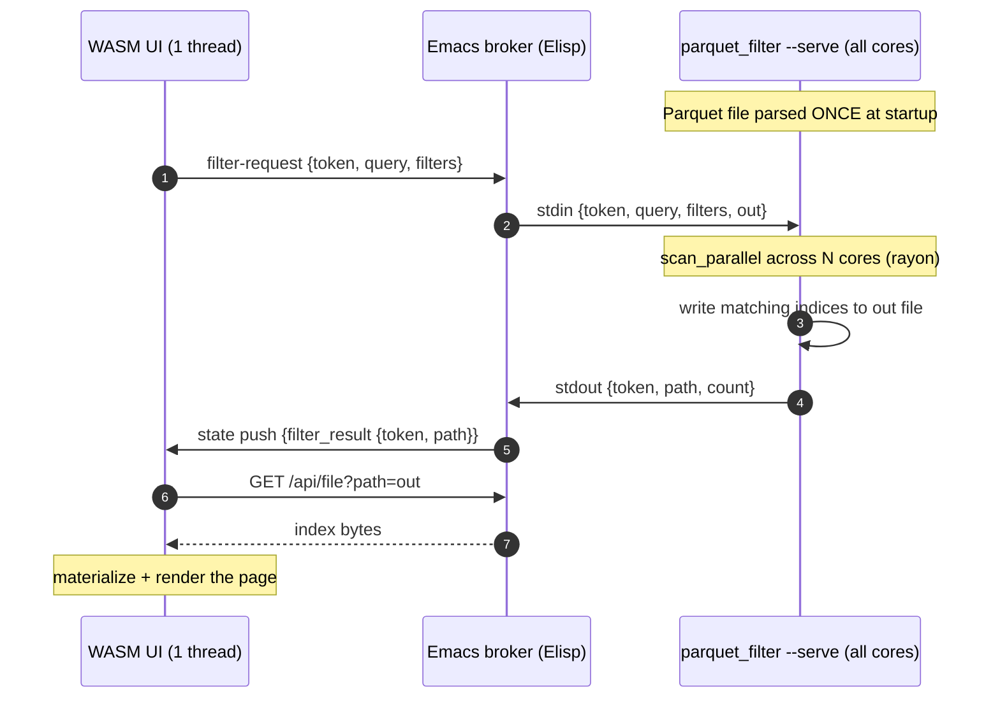
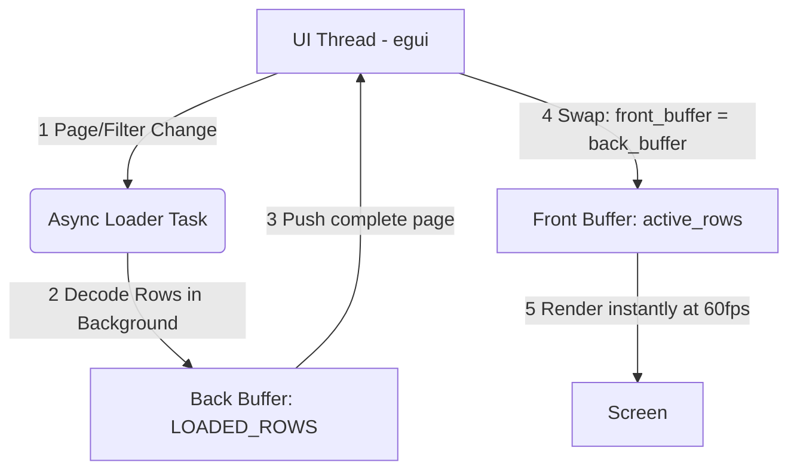

# Emacs Parquet Explorer

[](https://github.com/nohzafk/emacs-egui)
[](https://www.rust-lang.org/)
[](https://webassembly.org/)
[](#️-requirements)
[](LICENSE)

An interactive, GPU-accelerated visual data browser and query tool for large Parquet files, built inside Emacs using Rust and **egui** WebAssembly.

Layered on top of the generic [emacs-egui](https://github.com/nohzafk/emacs-egui) host framework, this package brings database-client-grade performance, fluid virtual scrolling, and high-volume analytics directly within a standard Emacs buffer.

## 🎬 Demo

https://github.com/user-attachments/assets/ed77499d-0b2a-4089-9c0d-edc70d013816

---

## 🌟 Key Features

1. **Double-Buffered Asynchronous Paging:** Browse datasets of arbitrary size fluidly. Uses an on-demand background worker to decode visible pages in sub-milliseconds, maintaining a constant visual memory footprint of **under 50MB** even on 3-million-row files.
2. **Schema & Metadata Inspection:** Side-by-side diagnostic panel displaying physical file details (compression codecs, row groups, version, author) and schema field type discovery.
3. **Adaptive Layout & Responsive Grid:** Scales dynamically to 100% of the active Emacs window height and width using nested horizontal and vertical virtual scroll container bounds.
4. **Sticky Column Headers:** Columns lock at the top of the viewport during vertical scrolling, while sliding in lockstep horizontally across extremely wide schemas (tested on 19+ columns).
5. **Configurable Paging Presets:** Paginates datasets dynamically with instant presets (`50`, `100`, `500`, `1000` rows) or a custom text entry for any specific limit.
6. **Global Text Substring Search:** Real-time, case-insensitive global text filtering matching substrings across all cells in every column.
7. **Dynamic Column Visibility:** Interactive checklist panel to show, hide, or prune columns dynamically to focus on key attributes.
8. **Predicate Pushdown & Cell Filtering:** Quick-filtering and column-specific predicate pushdowns to isolate anomalies and inspect unique records instantly.
9. **Interactive Clipboard Integration:** Selecting any cell displays its full detailed content in a resizable bottom panel and copies the cell value instantly into the Emacs `kill-ring` clipboard.
10. **Native Asynchronous CSV Export:** Direct background export of massive Parquet datasets into clean CSV files, running non-blockingly via an Elisp process wrapper.

---

## ⚙️ Requirements

- **macOS** — the supported and tested platform (see **Platform Support** below).
- **Emacs 29.1+** built **with xwidget support** (`(featurep 'xwidget-internal)`).
- A standard **Rust toolchain** (2021 edition) and [`wasm-pack`](https://rustwasm.github.io/wasm-pack/) to compile the WebAssembly UI.

### Platform Support — macOS only (for now)

The UI is an `egui` application compiled to WebAssembly that renders through
**WebGL** (`eframe`'s `glow` backend) onto an HTML `<canvas>` hosted inside
Emacs' `xwidget-webkit`. The "GPU-accelerated" experience therefore depends
entirely on the embedded WebKit view providing **hardware-accelerated WebGL** —
and that is only reliably true on macOS, because the two platforms embed
*different* WebKit engines:

- **macOS (supported / tested):** Emacs' xwidget backend is the native
  `nsxwidget` implementation, which embeds a Cocoa **`WKWebView`** — the same
  WebKit engine as Safari. WebGL is GPU-accelerated through Metal, so virtual
  scrolling and grid rendering run smoothly.
- **Linux (untested / unsupported):** Emacs' xwidget backend is **WebKitGTK**,
  which Emacs drives via *offscreen rendering*. GPU-accelerated WebGL through
  that offscreen path is unreliable and driver-dependent — notably blank on
  NVIDIA with the DMABUF compositor unless `WEBKIT_DISABLE_DMABUF_RENDERER=1` /
  `WEBKIT_DISABLE_COMPOSITING_MODE=1` are set, and it can silently fall back to
  software rendering (llvmpipe), defeating the GPU acceleration. Worse,
  WebKitGTK ≥ 2.41 broke the offscreen rendering that xwidgets rely on, leaving
  `xwidget-webkit` blank or crashing on several distributions (Emacs
  [bug#66068](https://debbugs.gnu.org/cgi/bugreport.cgi?bug=66068)). The app may
  not render at all there, and is currently neither tested nor supported.

> Linux reports and patches are welcome, but treat it as best-effort for now.

---

## 📦 Installation

The WebAssembly UI is compiled locally — there are **no prebuilt binaries in the
repo** — and `emacs-egui` is vendored as a git submodule (it is not on MELPA and
is intentionally **not** a `Package-Requires` dependency; the submodule supplies
both the Elisp framework and the Rust SDK used to build the UI). Every install
must therefore (1) fetch submodules and (2) build the UI into `ui/pkg/`.

### Option A — `use-package` with `:vc` (Emacs 30+)

A single declaration clones the repo, initialises the bundled `emacs-egui`
submodule, and compiles the UI — all at install time. It needs the Rust /
[`wasm-pack`](https://rustwasm.github.io/wasm-pack/) toolchain present, and you
must opt in to the build step via `package-vc-allow-build-commands`, since
`:shell-command` runs code on install.

```elisp
;; Allow the build step for this package (Emacs ignores :shell-command by default).
(setq package-vc-allow-build-commands '(emacs-parquet-explorer))

;; package-vc does NOT fetch git submodules, so the build step initialises them
;; (providing the emacs-egui Elisp + Rust SDK) and then compiles the UI.
(use-package emacs-parquet-explorer
  :vc (:url "https://github.com/nohzafk/emacs-parquet-explorer"
       :rev :newest
       :lisp-dir "lisp"
       :shell-command
       "git submodule update --init --recursive && cd ui && wasm-pack build --target web --release")
  :bind ("C-c d p" . emacs-parquet-explorer-open))
```

After `M-x package-vc-upgrade`, rebuild the UI with `M-x package-vc-rebuild RET
emacs-parquet-explorer`. On Emacs 29 (no `use-package` `:vc`) use Option B.

### Option B — Manual clone + raw Emacs Lisp (Emacs 29.1+)

```sh
git clone --recurse-submodules https://github.com/nohzafk/emacs-parquet-explorer.git \
  ~/src/emacs-parquet-explorer
cd ~/src/emacs-parquet-explorer
just setup   # one-time: wasm32-unknown-unknown target + wasm-pack
just wasm    # build the UI into ui/pkg/
# (already cloned shallow? git submodule update --init --recursive)
```

```elisp
;; Only this package's lisp/ is needed -- the bundled emacs-egui is discovered
;; automatically (or an emacs-egui already on your load-path is used instead).
(add-to-list 'load-path "~/src/emacs-parquet-explorer/lisp")
(load "emacs-parquet-explorer-autoloads" nil t)
(keymap-set global-map "C-c d p" #'emacs-parquet-explorer-open)
```

### Open a Parquet file

Run `C-c d p` or `M-x emacs-parquet-explorer-open`, then select any local
`.parquet` file.

---

## 🏛️ How It Works (Framework Integration)

`emacs-parquet-explorer` leverages the [emacs-egui](https://github.com/nohzafk/emacs-egui) framework for asset hosting, secure data streaming, and bidirectional Elisp-to-Rust communication:

```text
  +--------------------------------------------------------------------------+
  |                          Emacs Lisp Controller                           |
  |  - `emacs-parquet-explorer-open` registers the WASM application.         |
  |  - Binds "cell-selected" hook -> copies string to Emacs `kill-ring`.     |
  |  - Binds "export-csv" hook -> starts native asynchronous CLI process.    |
  +-------------------------------------+------------------------------------+
                                        | (1) filepath state push
                                        v
  +--------------------------------------------------------------------------+
  |                       emacs-egui Asset Server                            |
  |  - /app/emacs-parquet-explorer/ index.html & WASM bundles.               |
  |  - Streams raw Parquet binaries via secure gateway: /api/file?path=      |
  +-------------------------------------+------------------------------------+
                                        | (2) binary stream
                                        v
  +--------------------------------------------------------------------------+
  |                      Rust WebAssembly App (egui)                         |
  |  - Decodes binary streams into Arrow RecordBatch containers.             |
  |  - Performs column pruning, text filtering, and virtual grid rendering.  |
  +--------------------------------------------------------------------------+
```

### Direct Callback Hook Integration

- **Emacs Clipboard Sync:** When a user selects a cell inside the grid, egui triggers the `cell-selected` event. The Elisp layer catches the action, extracts the value, pushes it onto the `kill-ring`, and outputs a clean minibuffer message.
- **Asynchronous CSV Export:** When the user clicks "Export CSV" inside the egui layout, it triggers the `export-csv` event. Emacs prompts the user for a destination path, resolves the absolute paths, and invokes `cargo run --bin parquet_to_csv` via an asynchronous process (`make-process`), keeping the Emacs UI completely responsive during massive exports.
- **Native Filter Offload:** When the search query or column filters change, egui emits a `filter-request` event. Emacs feeds it to a persistent native scanner process and pushes the matching row indices back to the UI — moving the heavy scan off the WebView's single thread entirely (see [🚀 Native Multi-Core Sidecar](#-native-multi-core-sidecar)).

---

## 🧵 Threading Model & Bottleneck

The diagram below maps the data path onto the threads it actually runs on —
where bytes are distributed, where they are parsed, and where the work is
forced onto a single thread.



- **Data distribution (1–2)** is *not* the bottleneck: bytes arrive over an `await`-ed localhost stream from Emacs's asset server — async I/O, done once.
- **Parsing + matching (3–4)** *is* the bottleneck: decoding Parquet → Arrow → text and scanning millions of rows is pure CPU work on the **WebView's single main thread** — the same thread that drives the egui frame loop.
- **Rendering is off that thread:** egui only builds a vertex mesh on the main thread; the actual WebGL rasterization runs in WebKit's **GPU process**. That is why "WebGL is fast" and why fast rendering does nothing for the parse bottleneck — they live on different threads.

### The Single-Thread Constraint

All Rust/WASM application logic (Parquet decode **and** the egui frame loop) runs on **one JS thread** inside the embedded WebView. True *in-WebView* parallelism would need **Web Workers + WASM threads**, which require `SharedArrayBuffer` gated behind cross-origin isolation (COOP/COEP headers) — awkward/unavailable through emacs-egui's local asset server in the xwidget context, and `eframe`'s default web build is single-threaded regardless.

This package attacks the constraint from two directions:

1. **Make the one thread do less** — the in-WASM scan is heavily tuned (vectorized Arrow decode, allocation-free matching, debounced input, incremental narrowing, cooperative yielding). Fast enough for most queries, and the fallback whenever the sidecar is off. See [⚡ High-Performance](#-high-performance).
2. **Step outside the WebView** — by default the heavy scan is handed to a native, multi-core Rust process orchestrated by Emacs, which parses the file once and fans the scan across every CPU core. See [🚀 Native Multi-Core Sidecar](#-native-multi-core-sidecar).

---

## 🚀 Native Multi-Core Sidecar

Because Emacs is a native, multi-threaded host, the heavy scan does not have to run inside the WebView at all. By default (`emacs-parquet-explorer-use-native-filter`, set to `nil` to force the in-WASM path) each session starts a persistent **`parquet_filter --serve`** daemon. It parses the Parquet file **once** at startup and then answers queries from memory, scanning across **all CPU cores** with `rayon`. Search and filtering therefore leave the WebView's single thread entirely — the UI only renders the resulting page.



Design notes:

- **Parse once, serve many:** the daemon keeps the file in memory, so per-query cost is just the parallel scan — no re-read, no re-parse, no process spawn. A full global scan over 3M rows finishes in a few hundred milliseconds; a column-only predicate (which projects just that column) in tens.
- **Results by reference:** a match set can run into the millions of indices, so the daemon writes them to a temp file and returns only its path. The UI fetches that file through the asset server (`/api/file?path=`) instead of marshalling a giant array through `execute-script`.
- **Latest-wins coalescing:** while a scan is in flight, only the most recent query is queued; superseded results are discarded by `token`.
- **Graceful fallback:** if the sidecar is disabled, the file is unreadable, or the daemon errors or exits, the UI falls back to the in-WASM scan — so search always works.

> The sidecar needs the Rust toolchain at runtime; its binary is built automatically on first use. Set `emacs-parquet-explorer-use-native-filter` to `nil` to run everything in-WASM with no native process.

---

## ⚡ High-Performance

Working with multi-million-row Parquet files inside an embedded WebView demands
care on two fronts: loading rows for display without blowing the memory budget,
and searching or filtering across the whole dataset without freezing the UI.

### Double-Buffered Lazy Loading (3M+ Rows)

To support Parquet datasets of arbitrary size (such as the NYC Yellow Taxi dataset with over **3.06 million rows**) without freezing the UI thread or exceeding WebAssembly memory bounds, `emacs-parquet-explorer` employs a **Double-Buffered Asynchronous Loading Pipeline** compiled to WASM.

By shifting from eager row decoding (which consumed ~3.7GB of heap space for 3M rows) to on-demand row materialization, visual memory allocations remain constant at **under 50MB** regardless of dataset length.

#### Architectural Flow

The UI thread and background workers are fully decoupled using a Front/Back Buffer swap scheme:



#### Key Techniques

1. **In-Memory Byte Source:** The raw Parquet file is held once as `bytes::Bytes`; every reader is constructed over this shared buffer, so no bytes are re-read or re-allocated per page.
2. **On-Demand Row Materialization (`read_rows_subset`):** Maps the global row indices for the current page (even non-contiguous ones produced by filtering) into an Arrow `RowSelection`, so the reader materializes only those rows and skips the rest of the file.
3. **Double-Buffered State Swap:**
   - **Front Buffer (`active_rows`):** Holds only the rows for the currently rendered viewport page (~50–1000 items).
   - **Back Buffer (`LOADED_ROWS`):** A thread-safe static mutex updated by a local asynchronous worker spawned via `wasm_bindgen_futures::spawn_local`. Stale or out-of-order page requests are automatically discarded using version checks.

### Search & Filter Acceleration (in-WASM path)

When scans run inside the WebView — the fallback whenever the [native sidecar](#-native-multi-core-sidecar) is disabled or unavailable — they cover the entire dataset on a single thread, so the path is tuned to stay responsive while typing and to minimise repeated work:

1. **Debounced Input:** A search keystroke waits ~250ms before launching a scan, so typing a multi-character query triggers a single scan instead of one per key (filters, added by click, still apply immediately).
2. **Vectorized Arrow Decode:** Scans decode through the Arrow columnar reader, casting whole columns to text in one pass rather than materializing a record per row — cutting full-scan decode time by roughly **3×**. A column-only filter additionally projects just the filtered columns, skipping the rest.
3. **Allocation-Free Matching:** Case-insensitive substring matching compares bytes in place (ASCII case-folding) instead of allocating a lowercased `String` per cell — eliminating ~57M allocations per full scan.
4. **Incremental Narrowing:** When a query only grows (e.g. `joh` → `john`) and filters are unchanged, the new matches are a subset of the current results, so only those rows are re-scanned via a `RowSelection` — each extra character scans a shrinking set rather than all 3M rows.

Stale or superseded scans are cancelled mid-flight via version checks, and long scans yield to the browser event loop every 25,000 rows to keep rendering fluid.

---

## 📊 Verification & Performance Benchmarking

To verify that the build environment and performance optimizations are working seamlessly, you can test by downloading a real-world Yellow Taxi dataset (~47MB Parquet / over 3,000,000 rows):

```sh
curl -L -o yellow_tripdata_2023-01.parquet \
  "https://d37ci6vzurychx.cloudfront.net/trip-data/yellow_tripdata_2023-01.parquet"
```

Open `yellow_tripdata_2023-01.parquet` using `M-x emacs-parquet-explorer-open`.

- **Observe:** Over 3 million rows will load instantly.
- **Scroll:** Scroll vertically or horizontally with zero latency.
- **Prune:** Toggle columns (e.g. hiding `VendorID` or `tpep_pickup_datetime`) to see real-time table layout adjustments.
- **Export:** Export the entire dataset to a CSV file asynchronously in the background.

---

## 📄 License

This software is licensed under the MIT License. Feel free to copy, modify, and distribute it.
