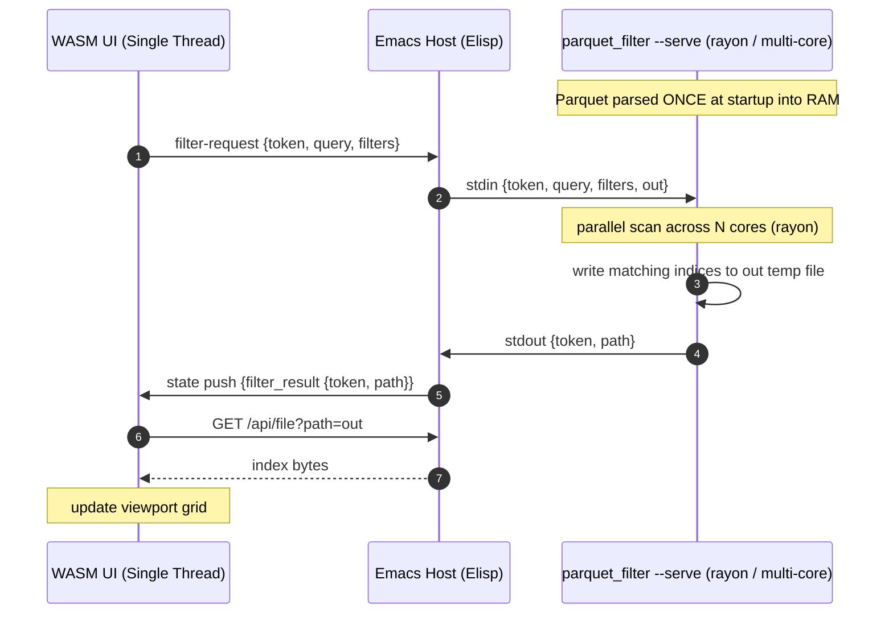
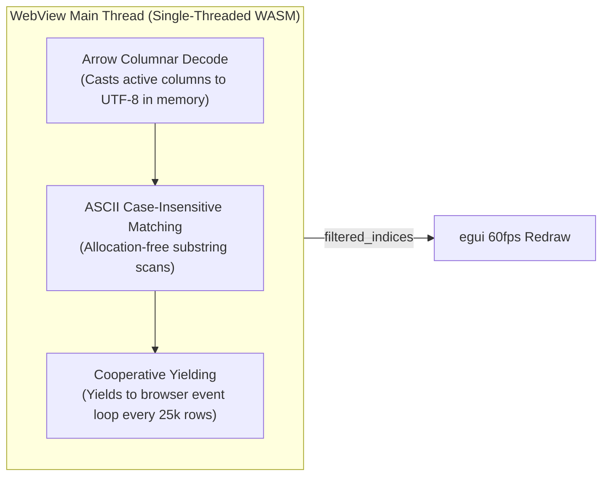
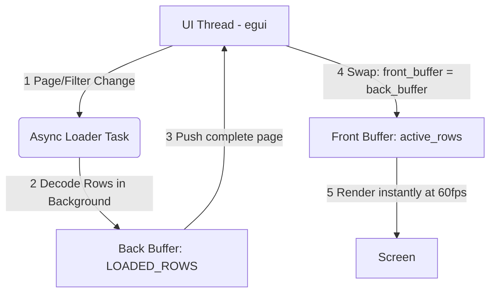

# Emacs Parquet Explorer

[](https://github.com/nohzafk/emacs-egui)
[](https://www.rust-lang.org/)
[](https://webassembly.org/)
[](#️-requirements)
[](LICENSE)

An interactive, GPU-accelerated visual data browser and query tool for large Parquet files, built inside Emacs using Rust and **egui** WebAssembly.

Layered on top of the generic [emacs-egui](https://github.com/nohzafk/emacs-egui) host framework, this package brings database-client-grade performance, fluid virtual scrolling, and high-volume analytics directly within a standard Emacs buffer.

## 🎬 Demo

<https://github.com/user-attachments/assets/ed77499d-0b2a-4089-9c0d-edc70d013816>

---

## 🌟 Key Features

1. **Double-Buffered Asynchronous Paging:** Browse datasets of arbitrary size fluidly. Uses an on-demand background worker to decode visible pages in sub-milliseconds, maintaining a constant visual memory footprint of **under 50MB** even on 3-million-row files.
2. **Schema & Metadata Inspection:** Side-by-side diagnostic panel displaying physical file details (compression codecs, row groups, version, author) and schema field type discovery.
3. **Adaptive Layout & Responsive Grid:** Scales dynamically to 100% of the active Emacs window height and width using nested horizontal and vertical virtual scroll container bounds.
4. **Sticky Column Headers:** Columns lock at the top of the viewport during vertical scrolling, while sliding in lockstep horizontally across extremely wide schemas (tested on 19+ columns).
5. **Configurable Paging Presets:** Paginates datasets dynamically with instant presets (`50`, `100`, `500`, `1000` rows) or a custom text entry for any specific limit.
6. **Global Text Substring Search:** Real-time, case-insensitive global text filtering matching substrings across all cells in every column.
7. **Dynamic Column Visibility:** Interactive checklist panel to show, hide, or prune columns dynamically to focus on key attributes.
8. **Predicate Pushdown & Cell Filtering:** Quick-filtering and column-specific predicate pushdowns to isolate anomalies and inspect unique records instantly.
9. **Interactive Clipboard Integration:** Selecting any cell displays its full detailed content in a resizable bottom panel and copies the cell value instantly into the Emacs `kill-ring` clipboard.
10. **Native Asynchronous CSV Export:** Direct background export of massive Parquet datasets into clean CSV files, running non-blockingly via an Elisp process wrapper.

---

## ⚙️ Requirements

- **macOS** — the supported and tested platform (see **Platform Support** below).
- **Emacs 29.1+** built **with xwidget support** (`(featurep 'xwidget-internal)`).
- A standard **Rust toolchain** (2021 edition) and [`wasm-pack`](https://rustwasm.github.io/wasm-pack/) to compile the WebAssembly UI.

### Platform Support — macOS only (for now)

The UI is an `egui` application compiled to WebAssembly that renders through
**WebGL** (`eframe`'s `glow` backend) onto an HTML `<canvas>` hosted inside
Emacs' `xwidget-webkit`. The "GPU-accelerated" experience therefore depends
entirely on the embedded WebKit view providing **hardware-accelerated WebGL** —
and that is only reliably true on macOS, because the two platforms embed
*different* WebKit engines:

- **macOS (supported / tested):** Emacs' xwidget backend is the native
  `nsxwidget` implementation, which embeds a Cocoa **`WKWebView`** — the same
  WebKit engine as Safari. WebGL is GPU-accelerated through Metal, so virtual
  scrolling and grid rendering run smoothly.
- **Linux (untested / unsupported):** Emacs' xwidget backend is **WebKitGTK**,
  which Emacs drives via *offscreen rendering*. GPU-accelerated WebGL through
  that offscreen path is unreliable and driver-dependent — notably blank on
  NVIDIA with the DMABUF compositor unless `WEBKIT_DISABLE_DMABUF_RENDERER=1` /
  `WEBKIT_DISABLE_COMPOSITING_MODE=1` are set, and it can silently fall back to
  software rendering (llvmpipe), defeating the GPU acceleration. Worse,
  WebKitGTK ≥ 2.41 broke the offscreen rendering that xwidgets rely on, leaving
  `xwidget-webkit` blank or crashing on several distributions (Emacs
  [bug#66068](https://debbugs.gnu.org/cgi/bugreport.cgi?bug=66068)). The app may
  not render at all there, and is currently neither tested nor supported.

> Linux reports and patches are welcome, but treat it as best-effort for now.

---

## 📦 Installation

The WebAssembly UI is compiled locally — there are **no prebuilt binaries in the
repo** — and `emacs-egui` is vendored as a git submodule (it is not on MELPA and
is intentionally **not** a `Package-Requires` dependency; the submodule supplies
both the Elisp framework and the Rust SDK used to build the UI). Every install
must therefore (1) fetch submodules and (2) build the UI into `ui/pkg/`.

### Option A — `use-package` with `:vc` (Emacs 30+)

A single declaration clones the repo, initialises the bundled `emacs-egui`
submodule, and compiles the UI — all at install time. It needs the Rust /
[`wasm-pack`](https://rustwasm.github.io/wasm-pack/) toolchain present, and you
must opt in to the build step via `package-vc-allow-build-commands`, since
`:shell-command` runs code on install.

```elisp
;; Allow the build step for this package (Emacs ignores :shell-command by default).
(setq package-vc-allow-build-commands '(emacs-parquet-explorer))

;; package-vc does NOT fetch git submodules, so the build step initialises them
;; (providing the emacs-egui Elisp + Rust SDK) and then compiles the UI.
(use-package emacs-parquet-explorer
  :vc (:url "https://github.com/nohzafk/emacs-parquet-explorer"
       :rev :newest
       :lisp-dir "lisp"
       :shell-command
       "git submodule update --init --recursive && cd ui && wasm-pack build --target web --release && cargo build --release --bins")
  :bind ("C-c d p" . emacs-parquet-explorer-open))
```

After `M-x package-vc-upgrade`, rebuild the UI with `M-x package-vc-rebuild RET
emacs-parquet-explorer`. On Emacs 29 (no `use-package` `:vc`) use Option B.

### Option B — Manual clone + raw Emacs Lisp (Emacs 29.1+)

```sh
git clone --recurse-submodules https://github.com/nohzafk/emacs-parquet-explorer.git \
  ~/src/emacs-parquet-explorer
cd ~/src/emacs-parquet-explorer
just setup   # one-time: wasm32-unknown-unknown target + wasm-pack
just wasm    # build both the WASM UI and native sidecar binaries
# (already cloned shallow? git submodule update --init --recursive)
```

```elisp
;; Only this package's lisp/ is needed -- the bundled emacs-egui is discovered
;; automatically (or an emacs-egui already on your load-path is used instead).
(add-to-list 'load-path "~/src/emacs-parquet-explorer/lisp")
(load "emacs-parquet-explorer-autoloads" nil t)
(keymap-set global-map "C-c d p" #'emacs-parquet-explorer-open)
```

### Open a Parquet file

Run `C-c d p` or `M-x emacs-parquet-explorer-open`, then select any local
`.parquet` file.

---

## 🔧 Native Sidecar Configuration

You can fully control how searches and filters are handled using the following custom Emacs variable:

```elisp
(defcustom emacs-parquet-explorer-use-native-filter t
  "When non-nil, offload search/filter scans to the native sidecar.
Scans run in the multi-threaded `parquet_filter` binary (via
`make-process`) instead of on the single-threaded WASM UI. When nil,
the UI scans in-process."
  :type 'boolean
  :group 'emacs-parquet-explorer)
```

### Forcing In-WASM Scans
If you want to run everything entirely in-process without spawning any native background daemons or compiling binaries at runtime, simply set:
```elisp
(setq emacs-parquet-explorer-use-native-filter nil)
```

---

## 🏛️ How It Works (Framework Integration)

`emacs-parquet-explorer` leverages the [emacs-egui](https://github.com/nohzafk/emacs-egui) framework for asset hosting, secure data streaming, and bidirectional Elisp-to-Rust communication:

```text
  +--------------------------------------------------------------------------+
  |                          Emacs Lisp Controller                           |
  |  - `emacs-parquet-explorer-open` registers the WASM application.         |
  |  - Binds "cell-selected" hook -> copies string to Emacs `kill-ring`.     |
  |  - Binds "export-csv" hook -> starts native asynchronous CLI process.    |
  +-------------------------------------+------------------------------------+
                                        | (1) filepath state push
                                        v
  +--------------------------------------------------------------------------+
  |                       emacs-egui Asset Server                            |
  |  - /app/emacs-parquet-explorer/ index.html & WASM bundles.               |
  |  - Streams raw Parquet binaries via secure gateway: /api/file?path=      |
  +-------------------------------------+------------------------------------+
                                        | (2) binary stream
                                        v
  +--------------------------------------------------------------------------+
  |                      Rust WebAssembly App (egui)                         |
  |  - Decodes binary streams into Arrow RecordBatch containers.             |
  |  - Performs column pruning, text filtering, and virtual grid rendering.  |
  +--------------------------------------------------------------------------+
```

### Direct Callback Hook Integration

- **Emacs Clipboard Sync:** When a user selects a cell inside the grid, egui triggers the `cell-selected` event. The Elisp layer catches the action, extracts the value, pushes it onto the `kill-ring`, and outputs a clean minibuffer message.
- **Asynchronous CSV Export:** When the user clicks "Export CSV" inside the egui layout, it triggers the `export-csv` event. Emacs prompts the user for a destination path, resolves the absolute paths, and invokes `cargo run --bin parquet_to_csv` via an asynchronous process (`make-process`), keeping the Emacs UI completely responsive during massive exports.
- **Native Filter Offload:** When the search query or column filters change, the UI emits a `filter-request` event. If the native sidecar is enabled and built, Emacs passes this request to the persistent sidecar process (`parquet_filter`) to run parallel queries, sending the results back asynchronously. If disabled, or if it fails, the UI gracefully degrades to the in-WASM fallback.

---

## 🗺️ Dual-Pathway Architecture & Performance Benchmarks

To ensure the best of both worlds—high performance for large datasets and a rock-solid safety net for any host environment—`emacs-parquet-explorer` implements two entirely distinct, hot-swappable search and filtering engines.

```text
               +-------------------------------------------+
               |             Search / Filter               |
               +---------------------+---------------------+
                                     |
                  Is `use-native-filter` non-nil?
                  Is Rust / Cargo available?
                                     |
                  +------------------+------------------+
                  | Yes                                 | No (or Failure)
                  v                                     v
  +-------------------------------+     +-------------------------------+
  |    Native Parallel Sidecar    |     |      In-WASM Local Fallback   |
  |  - Persistent process daemon  |     |  - Runs entirely inside UI    |
  |  - rayon multi-core parallel  |     |  - Single-threaded JS/WASM    |
  |  - Parses data ONCE into RAM  |     |  - Vectorized Arrow columns   |
  |  - Exchanges indices via file |     |  - Zero heap-alloc scans      |
  +-------------------------------+     +-------------------------------+
```

### 1. The Native Parallel Sidecar (Default)

When enabled, the explorer delegates heavy text matching and column parsing to an external native Rust process.



* **Parse-Once, Serve-Many:** The daemon process (`parquet_filter`) parses the Parquet file **once** on initialization. It retains the data in memory and answers subsequent queries instantly.
* **True Multithreading (`rayon`):** Heavy scan and substring search operations are fanned out across all physical CPU cores using Rust's `rayon` library. On a **3.06 million row** NYC Taxi dataset, a full global text scan finishes in just **297 ms** (down from **2,451 ms** on single-threaded WASM), representing a **~8.2× speedup** over optimized WASM, while a projected single-column numeric filter takes as little as **29 ms**.
* **Results-by-Reference:** A search query can return millions of matching row indices. To avoid sending large JSON payloads via Emacs scripts, the sidecar writes the indices directly to a temporary file (`/tmp/parquet-filter-*.json`) in binary representation. The WASM UI then retrieves this file via a standard HTTP request to the local `emacs-egui` server, bypassing performance limits of string serialization.
* **Automatic Fallback Compilation:** If the native binary is not compiled during installation (or is subsequently deleted), Emacs will automatically compile it asynchronously in the background using your local Rust toolchain (`cargo build --release --bin parquet_filter`) upon first use, starting the daemon instantly once compilation finishes.

### 2. The In-WASM Fallback (Safety Net)

If the native sidecar is disabled or fails to compile/run, the explorer seamlessly handles all computations in-process on the WebAssembly thread.



* **Always-Works Guarantee:** If the user runs Emacs in a sandboxed environment (e.g. flatpaks, remote TRAMP sessions), has environment/path conflicts inside GUI Emacs on macOS, or lacks a Rust toolchain, search and filtering degrade to the in-WASM fallback and continue functioning perfectly.
* **Low-Complexity Plain Full-Scan:** Following a major simplification, the in-WASM pathway uses a plain, single-threaded full-scan on the WASM thread. This removes the dual-state complexity (incremental caching, narrowing `RowSelection` branches, version updates) and ensures absolute reliability.
* **Highly Optimized Fallback:**
  * **Vectorized Column Projection (Arrow columnar decode):** Shifting from standard row-level parsing to vectorized Arrow columnar decoding resulted in a **~3.2× speedup** (reducing full global scan time on a 3M row file from **7,820 ms** to **2,451 ms**). The WASM reader only decodes the subset of columns required by the active filters, minimizing decoding overhead.
  * **Allocation-Free Matching:** Text matching performs case-insensitive search using in-place byte comparisons, eliminating heap allocations for each row cell (saving ~60 million allocations for a 3M row dataset).
  * **Cooperative Yielding & Debouncing:** Keystrokes are debounced by **250 ms** to avoid redundant scans. The scan yields control back to the browser's event loop every 25,000 rows to ensure the UI remains fluid and responsive without freezing the browser tab.

---

### 📦 Constant-Memory Virtual Grid (WASM-based, Always Active)

Regardless of which pathway is handling search filters, visual grid rendering is always managed inside the WebView. To support Parquet datasets of arbitrary size (such as the NYC Yellow Taxi dataset with over **3.06 million rows**) without freezing the UI thread or exceeding WebAssembly memory bounds, `emacs-parquet-explorer` employs a **Double-Buffered Asynchronous Loading Pipeline** compiled to WASM.

By shifting from eager row decoding (which consumed ~3.7GB of heap space for 3M rows) to on-demand row materialization, visual memory allocations remain constant at **under 50MB** regardless of dataset length.

#### Architectural Flow

The UI thread and background workers are fully decoupled using a Front/Back Buffer swap scheme:



#### Key Techniques

1. **In-Memory Byte Source:** The raw Parquet file is held once as `bytes::Bytes` in the WASM linear memory; every reader is constructed over this shared buffer, so no bytes are re-read or re-allocated per page.
2. **On-Demand Row Materialization (`read_rows_subset`):** Maps the global row indices for the current page (even non-contiguous ones produced by filtering) into an Arrow `RowSelection`, so the reader materializes only those rows and skips the rest of the file.
3. **Double-Buffered State Swap:**
   - **Front Buffer (`active_rows`):** Holds only the rows for the currently rendered viewport page (~50–1000 items).
   - **Back Buffer (`LOADED_ROWS`):** A thread-safe static mutex updated by a local asynchronous worker spawned via `wasm_bindgen_futures::spawn_local`. Stale or out-of-order page requests are automatically discarded using version checks.

---

## 🧵 Threading Model & Bottleneck Analysis

All WebAssembly execution inside the embedded WebView runs on **a single JavaScript main thread**. In-WebView multithreading would require Web Workers and `SharedArrayBuffer` gated behind strict cross-origin isolation headers (COOP/COEP), which are generally unavailable through local Emacs asset hosting.

The dual-pathway architecture resolves this bottleneck elegantly:

| Feature / Pathway | 🚀 Native Sidecar (Default) | ⚡ In-WASM Fallback (Safety Net) |
| :--- | :--- | :--- |
| **Execution Context** | External Native Process | WebView Main Thread |
| **Multithreading** | **Yes** (Rayon parallel scan on all cores) | **No** (Single-threaded JS thread) |
| **Data Memory** | Parsed once in host memory | Decoded from raw bytes in WASM heap |
| **UI Responsiveness** | Perfect (WASM main thread stays idle) | High (Cooperative yielding every 25k rows) |
| **External Dependencies**| Local Rust toolchain (`cargo`), subprocesses | None (Self-contained WASM bundle) |
| **Use-Case** | Massive datasets (3M+ rows), high speed | Restricted systems, missing toolchain, opt-out |

---

## 📊 Verification & Real-World Benchmarks

To verify that the build environment and performance optimizations are working seamlessly, you can test by downloading a real-world Yellow Taxi dataset (~47MB Parquet / over 3,000,000 rows):

```sh
curl -L -o yellow_tripdata_2023-01.parquet \
  "https://d37ci6vzurychx.cloudfront.net/trip-data/yellow_tripdata_2023-01.parquet"
```

Open `yellow_tripdata_2023-01.parquet` using `M-x emacs-parquet-explorer-open`.

### 🏎️ Performance Table

The following benchmarks are measured using the **3.06 million row** NYC Yellow Taxi dataset:

| Execution Pathway / Mode | Scanning Duration | Performance Notes |
| :--- | :--- | :--- |
| **WASM Fallback (Row-API)** | **7,820 ms** | Eager, unoptimized row scanning (deprecated) |
| **WASM Fallback (Arrow Columnar)** | **2,451 ms** | **~3.2× speedup**; single-threaded in WebView |
| **Native Sidecar (Serial)** | **2,238 ms** | Single-threaded external process |
| **Native Sidecar (Parallel - 14 Cores)**| **297 ms** | **~8.2× speedup** over optimized WASM; rayon-parallelized across all cores |
| **Native Sidecar (Projected Filter)** | **29 ms** | **~80× faster** than optimized WASM; projects and scans a single column |

*Note: The native parallel sidecar performs an end-to-end parallel search, matching 142,568 rows and outputting a 1.1 MB JSON index file in just **223 ms**.*

---

## 📄 License

This software is licensed under the MIT License. Feel free to copy, modify, and distribute it.
