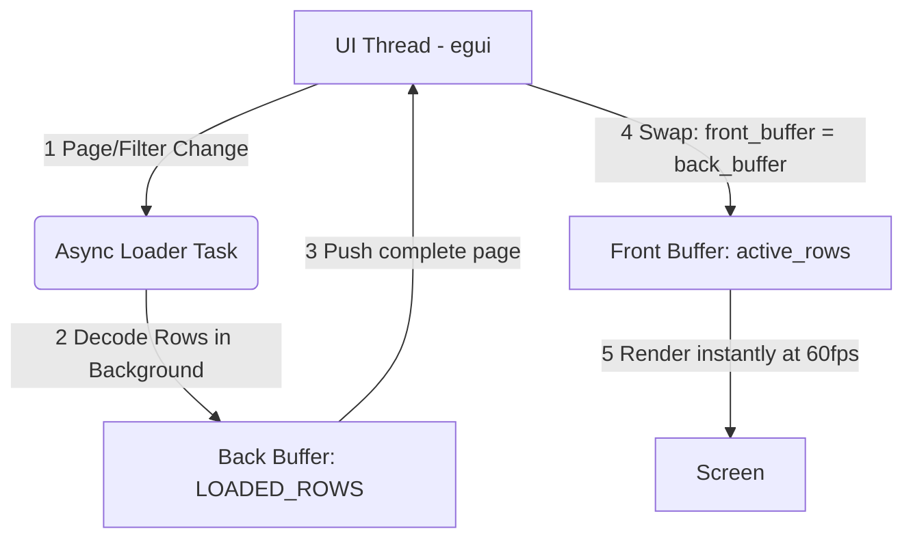

# Emacs Parquet Explorer

[](https://github.com/nohzafk/emacs-egui)
[](https://www.rust-lang.org/)
[](https://webassembly.org/)
[](LICENSE)

An interactive, GPU-accelerated visual data browser and query tool for large Parquet files, built inside Emacs using Rust and **egui** WebAssembly.

Layered on top of the generic [emacs-egui](https://github.com/nohzafk/emacs-egui) host framework, this package brings database-client-grade performance, fluid virtual scrolling, and high-volume analytics directly within a standard Emacs buffer.

---

## 🌟 Key Features

1. **Double-Buffered Asynchronous Paging:** Browse datasets of arbitrary size fluidly. Uses an on-demand background worker to decode visible pages in sub-milliseconds, maintaining a constant visual memory footprint of **under 50MB** even on 3-million-row files.
2. **Schema & Metadata Inspection:** Side-by-side diagnostic panel displaying physical file details (compression codecs, row groups, version, author) and schema field type discovery.
3. **Adaptive Layout & Responsive Grid:** Scales dynamically to 100% of the active Emacs window height and width using nested horizontal and vertical virtual scroll container bounds.
4. **Sticky Column Headers:** Columns lock at the top of the viewport during vertical scrolling, while sliding in lockstep horizontally across extremely wide schemas (tested on 19+ columns).
5. **Configurable Paging Presets:** Paginates datasets dynamically with instant presets (`50`, `100`, `500`, `1000` rows) or a custom text entry for any specific limit.
6. **Global Text Substring Search:** Real-time, case-insensitive global text filtering matching substrings across all cells in every column.
7. **Dynamic Column Visibility:** Interactive checklist panel to show, hide, or prune columns dynamically to focus on key attributes.
8. **Predicate Pushdown & Cell Filtering:** Quick-filtering and column-specific predicate pushdowns to isolate anomalies and inspect unique records instantly.
9. **Interactive Clipboard Integration:** Selecting any cell displays its full detailed content in a resizable bottom panel and copies the cell value instantly into the Emacs `kill-ring` clipboard.
10. **Native Asynchronous CSV Export:** Direct background export of massive Parquet datasets into clean CSV files, running non-blockingly via an Elisp process wrapper.

---

## ⚙️ Requirements

- **Emacs 29.1+** built **with xwidget support** (`(featurep 'xwidget-internal)`).
- A standard **Rust toolchain** (2021 edition) and [`wasm-pack`](https://rustwasm.github.io/wasm-pack/) to compile the WebAssembly UI.

---

## 📦 Installation

The WebAssembly UI is compiled locally — there are **no prebuilt binaries in the
repo** — and `emacs-egui` is vendored as a git submodule (it is not on MELPA and
is intentionally **not** a `Package-Requires` dependency; the submodule supplies
both the Elisp framework and the Rust SDK used to build the UI). Every install
must therefore (1) fetch submodules and (2) build the UI into `ui/pkg/`.

### Option A — `use-package` with `:vc` (Emacs 30+)

A single declaration clones the repo, initialises the bundled `emacs-egui`
submodule, and compiles the UI — all at install time. It needs the Rust /
[`wasm-pack`](https://rustwasm.github.io/wasm-pack/) toolchain present, and you
must opt in to the build step via `package-vc-allow-build-commands`, since
`:shell-command` runs code on install.

```elisp
;; Allow the build step for this package (Emacs ignores :shell-command by default).
(setq package-vc-allow-build-commands '(emacs-parquet-explorer))

;; package-vc does NOT fetch git submodules, so the build step initialises them
;; (providing the emacs-egui Elisp + Rust SDK) and then compiles the UI.
(use-package emacs-parquet-explorer
  :vc (:url "https://github.com/nohzafk/emacs-parquet-explorer"
       :rev :newest
       :lisp-dir "lisp"
       :shell-command
       "git submodule update --init --recursive && cd ui && wasm-pack build --target web --release")
  :bind ("C-c d p" . emacs-parquet-explorer-open))
```

After `M-x package-vc-upgrade`, rebuild the UI with `M-x package-vc-rebuild RET
emacs-parquet-explorer`. On Emacs 29 (no `use-package` `:vc`) use Option B.

### Option B — Manual clone + raw Emacs Lisp (Emacs 29.1+)

```sh
git clone --recurse-submodules https://github.com/nohzafk/emacs-parquet-explorer.git \
  ~/src/emacs-parquet-explorer
cd ~/src/emacs-parquet-explorer
just setup   # one-time: wasm32-unknown-unknown target + wasm-pack
just wasm    # build the UI into ui/pkg/
# (already cloned shallow? git submodule update --init --recursive)
```

```elisp
;; Only this package's lisp/ is needed -- the bundled emacs-egui is discovered
;; automatically (or an emacs-egui already on your load-path is used instead).
(add-to-list 'load-path "~/src/emacs-parquet-explorer/lisp")
(load "emacs-parquet-explorer-autoloads" nil t)
(keymap-set global-map "C-c d p" #'emacs-parquet-explorer-open)
```

### Open a Parquet file

Run `C-c d p` or `M-x emacs-parquet-explorer-open`, then select any local
`.parquet` file.

---

## 🏛️ How It Works (Framework Integration)

`emacs-parquet-explorer` leverages the [emacs-egui](https://github.com/nohzafk/emacs-egui) framework for asset hosting, secure data streaming, and bidirectional Elisp-to-Rust communication:

```text
  +--------------------------------------------------------------------------+
  |                          Emacs Lisp Controller                           |
  |  - `emacs-parquet-explorer-open` registers the WASM application.         |
  |  - Binds "cell-selected" hook -> copies string to Emacs `kill-ring`.     |
  |  - Binds "export-csv" hook -> starts native asynchronous CLI process.    |
  +-------------------------------------+------------------------------------+
                                        | (1) filepath state push
                                        v
  +--------------------------------------------------------------------------+
  |                       emacs-egui Asset Server                            |
  |  - /app/emacs-parquet-explorer/ index.html & WASM bundles.               |
  |  - Streams raw Parquet binaries via secure gateway: /api/file?path=      |
  +-------------------------------------+------------------------------------+
                                        | (2) binary stream
                                        v
  +--------------------------------------------------------------------------+
  |                      Rust WebAssembly App (egui)                         |
  |  - Decodes binary streams into Arrow RecordBatch containers.             |
  |  - Performs column pruning, text filtering, and virtual grid rendering.  |
  +--------------------------------------------------------------------------+
```

### Direct Callback Hook Integration

- **Emacs Clipboard Sync:** When a user selects a cell inside the grid, egui triggers the `cell-selected` event. The Elisp layer catches the action, extracts the value, pushes it onto the `kill-ring`, and outputs a clean minibuffer message.
- **Asynchronous CSV Export:** When the user clicks "Export CSV" inside the egui layout, it triggers the `export-csv` event. Emacs prompts the user for a destination path, resolves the absolute paths, and invokes `cargo run --bin parquet_to_csv` via an asynchronous process (`make-process`), keeping the Emacs UI completely responsive during massive exports.

---

## ⚡ High-Performance Double-Buffered Lazy Loading (3M+ Rows)

To support Parquet datasets of arbitrary size (such as the NYC Yellow Taxi dataset with over **3.06 million rows**) without freezing the UI thread or exceeding WebAssembly memory bounds, `emacs-parquet-explorer` employs a **Double-Buffered Asynchronous Loading and Background-Filtering Pipeline** compiled to WASM.

By shifting from eager row decoding (which consumed ~3.7GB of heap space for 3M rows) to an on-demand, lazy byte-slicing mechanism, visual memory allocations remain constant at **under 50MB** regardless of dataset length.

### Architectural Flow

The UI thread and background workers are fully decoupled using a Front/Back Buffer swap scheme:



### Key Techniques

1. **Group-Skipping Parquet Byte Slicer:** Slices row groups sequentially inside the raw in-memory `bytes::Bytes`. It skips entire row groups instantly without opening or allocating them if they lie outside the requested range.
2. **On-Demand Single-Pass Sequential Decoder (`read_rows_subset`):** Maps global row indices (even non-contiguous ones produced by filtering) and reads them sequentially. It opens each row group at most once, maintaining maximum scanning speed.
3. **Double Buffered State Swap:**
   - **Front Buffer (`active_rows`):** Holds only the rows for the currently rendered viewport page (~50–1000 items).
   - **Back Buffer (`LOADED_ROWS`):** A thread-safe static mutex updated by a local asynchronous worker spawned via `wasm_bindgen_futures::spawn_local`. Stale or out-of-order page requests are automatically discarded using version checks.
4. **Asynchronous Yielding Filter Scans:** When a user types a global search or column predicate filter, a background async scanner indexes the 3.06M rows in chunks of 25,000, yielding execution to the browser's event loop via Resolved Promises to prevent frame drops or UI freezing.

---

## 📊 Verification & Performance Benchmarking

To verify that the build environment and performance optimizations are working seamlessly, you can test by downloading a real-world Yellow Taxi dataset (~47MB Parquet / over 3,000,000 rows):

```sh
curl -L -o yellow_tripdata_2023-01.parquet \
  "https://d37ci6vzurychx.cloudfront.net/trip-data/yellow_tripdata_2023-01.parquet"
```

Open `yellow_tripdata_2023-01.parquet` using `M-x emacs-parquet-explorer-open`.

- **Observe:** Over 3 million rows will load instantly.
- **Scroll:** Scroll vertically or horizontally with zero latency.
- **Prune:** Toggle columns (e.g. hiding `VendorID` or `tpep_pickup_datetime`) to see real-time table layout adjustments.
- **Export:** Export the entire dataset to a CSV file asynchronously in the background.

---

## 📄 License

This software is licensed under the MIT License. Feel free to copy, modify, and distribute it.
